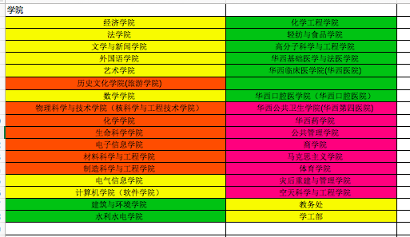

# 第一周开发报告
## 本周已完成

- 完成新闻网站调查工作的划分, 这部分工作将持续进行。
- 已完成简单的需求设计, 即完成一个用来抓取新闻网站的后台工具
- 详细计划正在筹划当中

调查工作的划分:



### 另:计划外

原先已经完成了一部分的爬虫工作, 但目前部署在负责人的个人工程文件里面, 等需求确定下来之后, 再部署到该repo。<br />
爬虫功能的架构, 实际上不受需求变化的影响, 故在此介绍一下:

### `NoticeFetcher`

抽象类`NoticeService`的结构, 采用组件化的方式, 即scala中的mixin模式, 代码形式上, 继承了`UrlService`, `IndexService`, `NoticeFetcher`这三个特质(trait, 类似于Java 8中带默认实现的接口), 代码如下

```scala
abstract class NoticeService(val source: String) extends UrlService with IndexService with NoticeFetcher {
  def getUrls: Iterable[NoticeEntry] =
    indexUrls.map(u ⇒ Try(noticeUrlsFromUrl(u))).takeWhile(_.isSuccess).flatMap(_.get) //注意indexUrls和noticeUrlsFromUrl方法未实现
  def notices(after: Date = new Date(0)): Iterable[Notice] = getUrls.map(n ⇒
    Try(fetch(n))).filter(_.isSuccess).map(_.get).takeWhile(_.date.after(after)) //注意fetch方法未实现
}
```

NoticeService需要用到继承的三个特质的方法(代码注释已标出), 其中(scala中默认可见范围为public), `UrlService`提供`noticeUrlsFromUrl(String): Iterable[NoticeEntry]`方法, 通过给定的索引链接返回新闻标题和链接(封装在`NoticeEntry`)的序列, `IndexService`提供`indexUrls: Iterable[String]`方法, 给出索引链接的序列(一个新闻网站的目录有很多页), `NoticeFetcher`提供`fetch(NoticeEntry): Notice`方法, 通过给定的新闻链接和标题, 提取出新闻(封装成`Notice`), 为了方便起见, 定义了一些protected方法, 在这里可以忽略:

```scala
trait UrlService {
  def noticeUrlsFromUrl(url: String): Iterable[NoticeEntry]
}

trait IndexService {
  protected val template: String
  protected val firstIndex: Int = 1
  protected def valueStream(i: Int): Stream[Int] = i #:: valueStream(i + 1)
  protected def indexNums: Iterable[Any] = valueStream(firstIndex)
  protected def interpolate(value: Any): String = template.replaceAll("<index>", value.toString)
  def indexUrls: Iterable[String] = indexNums map interpolate
}

trait NoticeFetcher extends Util with DateUtils {
  protected def parse(doc: Document, title: Option[String]): Notice
  protected def exDate(arg: String) = {
    val du.dMatch(dStr) = arg
    new Date(dStr replaceAll (du.splittersOr, "/"))
  }
  private def absLink(doc: Document) = {
    List("href", "src").foreach(n ⇒ doc.select(s"[$n]").asScala.map(l ⇒ l.attr(n, l.attr(s"abs:$n"))))
    doc
  }
  def fetch(entry: NoticeEntry): Notice = parse(absLink(Jsoup.connect(entry.url).get), entry.title)
}
```

上述代码中, 在实例化的时候, 只需混入已经实现好的具体trait即可, 例如:

```scala
val ns = new NoticeService("文新学院 - 学院动态 - test") with UniversalUrlService with UniversalNoticeFetcher with IndexService {
  val template = "http://www.sculj.cn/Special_News.asp?SpecialID=40&SpecialName=%D1%A7%D4%BA%B6%AF%CC%AC&page=<index>"
}
```

`UniversalUrlService`和`UniversalNoticeFetcher`分别是`UrlService`和`NoticeFetcher`的实现, 前者需要提供template的属性值, 而`IndexService`实际本身不是抽象特质, 直接使用即可

现在, ns已经是`NoticeService`的具体类实例, 可以直接使用:

```scala
val news = ns.notices().take(5).toList
```

如此即可得到一个含有5个Notice对象的List, 注意notices返回的Iterable具有惰性计算的特性(直到调用toList的时候才计算), 故只会抓取前五个新闻, 多余者不会重复抓取。

## 接下来的工作

- 与服务器组协商, 完成本组的需求设计
- 继续进行新闻网站的调查
- 完成详细计划
